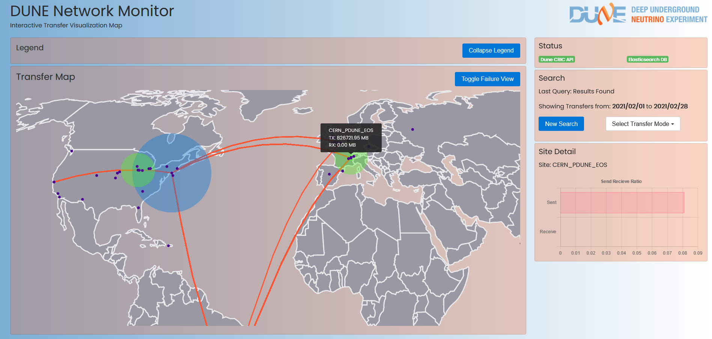

# Dune data visualizer Alpha



## About
___
The Dune Network Monitor exists to visualize the flow of data between facilities across the world participating in the Deep Underground Neutrino Project. By interfacing with the elasticsearch API our app\
lication creates a graphical representation of file transfers, bandwidth, and network reliability.

## Installation
___

## Step 0, ensure NPM and Python3 are installed on the host machine:

On linux run something like (package manager dependant): 

```
sudo apt-get install npm
sudo dnf install npm
yum install NPM 
etc...
```

<br>
Similiar syntax for python:

```
sudo apt-get install Python3 
sudo dnf install Python3
yum install Python3
etc...
```

**On mac use homebrew, type: "brew install node"**

<br>
<br>

## Next install the "forever" package for NPM

(from root or with SUDO)

Ex: 

```
sudo npm install forever -g
```

<br>
<br>


## Also ensure that firefox is installed

```
yum install firefox
```

<br>
<br>

## First step if you haven't run the demo thus far is to run setupEverything.sh

To do first time setup run 

```
sh setupEverything.sh
```
*estimated time: ~1-2 minutes*

<br>
<br>

## After that run the included start and stop scripts as follows:

To start: run "sh startEverything.sh"

Ex: 
```
startEverything.sh
```

*estimated time: ~1-3 minutes*

After which a browser window should launch with the network visualization.

<br>
<br>

**At this point the software will stay running, even after logout, until stopped with the "stopEverything.sh" script is run**

To stop, run:
```
sh stopEverything.sh
```